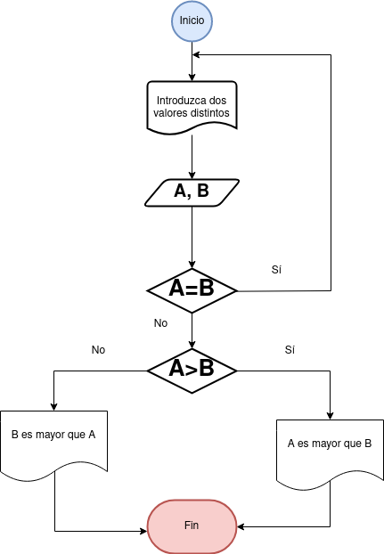

# Ejercicios

- [Ejercicio 1](#ejercicio-1)
- [Ejercicio Propuestos 1](#ejercicio-propuestos-1)

## Ejercicio 1 

Desarrolle un algoritmo que permita leer dos valores distintos, determinar cual de los dos valores es el menor y escribirlo.

Diagrama

### Pseudocódigo

Pseudocódigo

Pasos: 
- Inicio

- Inicializamos las variables: __A = 0, B = 0__

- Solicitar la introducción de dos valores distintos

- Leer los dos valores

- Asignarlos a las variables __A__ y __B__

- Si ___A = B___ Entonces vuelve a 3 porque los valores deben ser distintos

- Si ___A > B___ Entonces Escribir __A, “Es el mayor"__

- De lo contrario: Escribir __B, “Es el mayor"__

- Fin_Si

- Fin

## Ejercicio Propuestos 1 

 (A)  Desarrolle un algoritmo que permita leer dos valores distintos determinar cual de los dos valores es el menor y escribirlo.

 (B) Realizar un algoritmo que sume dos números.

### Diagrama de Flujo

Diagrama a

Diagrama b

### Pseudocódigo

Pseudocódigo a

Pasos: 
- Inicio

- Inicializamos las variables: __A = 0, B = 0__

- Solicitar la introducción de dos valores distintos

- Leer los dos valores

- Asignarlos a las variables __A__ y __B__

- Si ___A = B___ Entonces vuelve a 3 porque los valores deben ser distintos

- Si ___A < B___ Entonces Escribir __A, “Es el menor"__

- De lo contrario: Escribir __B, “Es el menor"__

- Fin_Si

- Fin

Pseudocódigo b

Pasos: 
- Inicio

- Inicializamos las variables: __A = 0, B = 0 y C = 0__

- Solicitar la introducción de dos valores.

- Leer los dos valores

- Asignarlos a las variables __A__ y __B__

- Hacer la operación ___A + B = C___ y de esa manera asignar el valor de __C__

- Escribir "El resultado de la suma ___A + B___ es :" ___C___

- Fin

